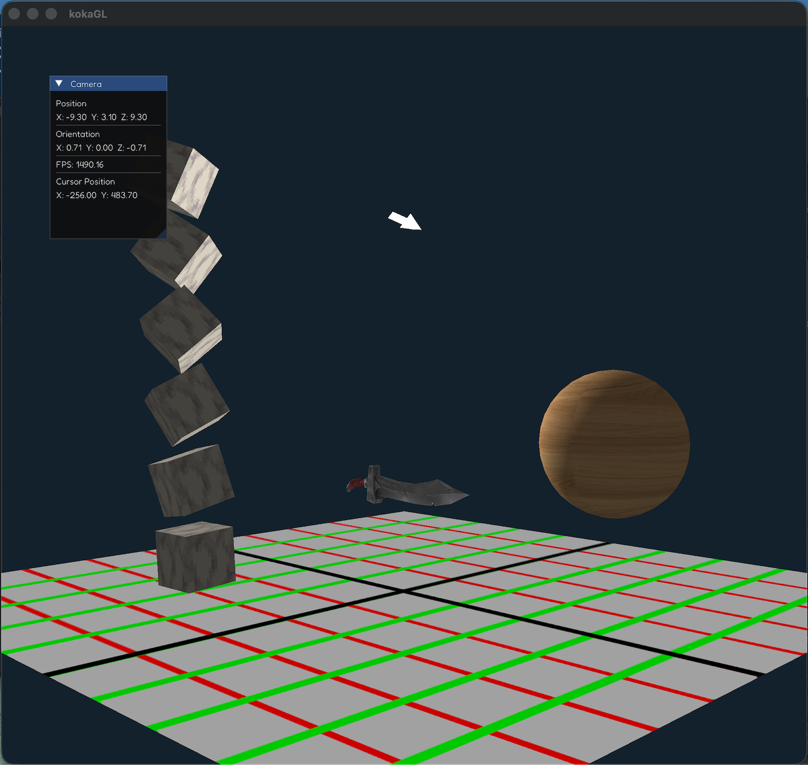

# KokaGL 
This project supersedes [koka3d](https://github.com/kokalikesboba/koka3D) in spirit. It is my first hardware accelerated renderer and it uses the OpenGL API. 

You can find design goals, quirks, and documentations on the [wiki](https://github.com/kokalikesboba/kokaGL/wiki) tab.

TODO: Image above is is borked unavailable cuz at the minute after a parser rework. :(

# Features:
- GLTF File Parsing and loading.
- Viewport manipulation.
- Variable window refresh rate.
- Framebuffers and GLSL post processing.
- Lambert Shading.
- Deltatime implementation.

# Installation

### You must have an OpenGL 3.3+ capable GPU.

Included are Visual Studio Code profiles that work on Ubuntu 25.04 and MacOS Tahoe. Regardless of if you wish to use them or not, you must have the following packages installed system wide to build with `make`.

- `Clang`
- `GLFW 3.4`

Use `brew` or `apt` for them.

Additionally, if you wish you use the VSCode profiles, you must  install the `CodeLLDB` extension since this is the expected debugger.

Other dependencies such as GLAD, glm, stb, ImGUI, simdjson, fastgltf, are already included in this repository under the `extern/` directory and require no further installation.
